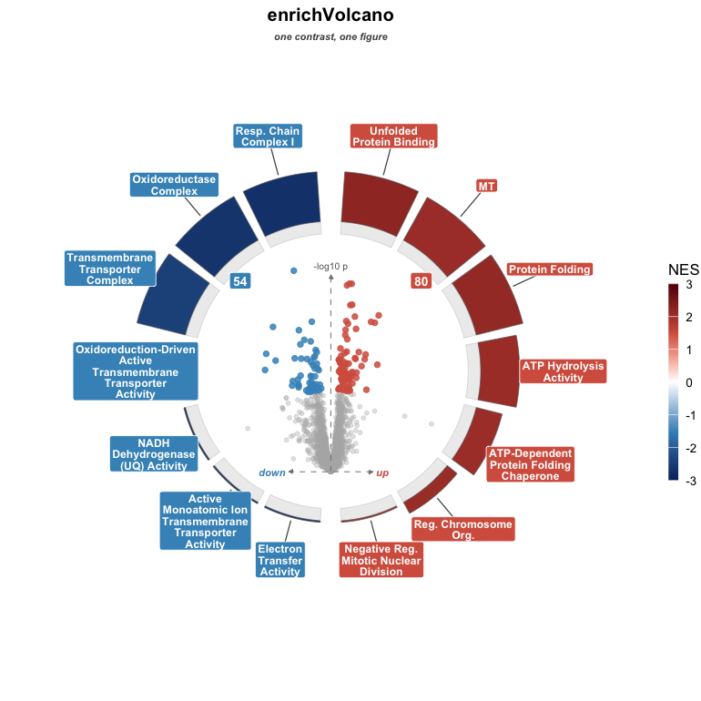

# enrichVolcano

> Draw a volcano-in-ring composite from any differential-abundance table
> plus any enrichment table you’ve already computed.



`enrichVolcano` is a plotting-only package. It does **not** run
differential abundance, it does **not** run enrichment, and it ships no
gene-set databases. Compute those upstream with whatever fits your study
— `fgsea`, `clusterProfiler`, `enrichR`, or your own — and hand the two
tidy tables to `volcano_ring()`.

## What the plot encodes

One figure carries four layers of the same contrast:

- **Centre** — the differential-abundance volcano: `logFC` on x,
  `-log10(p)` on y, points coloured up / down / non-significant.
- **Ring** — one arc per enriched pathway. Arc **fill** is the NES (red
  up, blue down by default); arc **thickness** is a magnitude you pick
  (`-log10(padj)` or gene-set size).
- **Split** — up-regulated pathways sit on the top semicircle,
  down-regulated on the bottom, so direction reads at a glance.
- **Tick lines** — thin spokes drop from each arc to its leading-edge
  genes inside the volcano, tying a pathway to the proteins driving it.
- **Badges** — running counts of significant up / down proteins.

`volcano_ring_grid()` composes several contrasts into a labelled grid
with a shared NES legend.

## Install

``` r
# install.packages("remotes")
remotes::install_github("Dustyn-T-Lewis/enrichVolcano")
```

## Quick start

``` r
library(enrichVolcano)

da <- read.csv(system.file("extdata", "examples", "yvo_da.csv",
  package = "enrichVolcano"
))
en <- read.csv(system.file("extdata", "examples", "yvo_enrichment.csv",
  package = "enrichVolcano"
))

ctr <- "Training_Young"
da1 <- da[da$contrast == ctr, ]
names(da1)[names(da1) == "adj.P.Val"] <- "padj"

# Pick the pathways to ring the volcano (the table holds many databases).
sig <- en[en$contrast == ctr & en$padj < 0.05 & is.finite(en$NES), ]
sig <- sig[order(sig$padj), ]
top <- rbind(head(sig[sig$NES > 0, ], 7), head(sig[sig$NES < 0, ], 7))

volcano_ring(da1, top, title = "YvO", subtitle = ctr)
```

## Input contract, in brief

| Side | Needs | Default column |
|----|----|----|
| DA (`volc_df`) | gene id, effect, p, adjusted p | `gene`, `logFC`, `P.Value`, `padj` |
| Enrichment (`enrich_df`) | term, NES, adjusted p, size | `pathway`, `NES`, `padj`, `size` |
| Tick lines (optional) | leading-edge genes | auto-detected from `leading_edge` / `leadingEdge` / `core_enrichment` / `Genes` |

Every column name is an argument, so non-default schemas work without
renaming. See `vignette("input-contract")` for the limma / DESeq2 /
edgeR / DEP / fgsea / clusterProfiler / enrichR cross-walk.

## Customizing

Looks live in `volcano_ring_theme()` (palette presets, or your own `up`
/ `down` / `ns` / `nes_colors`); layout lives in `volcano_ring()`
arguments (`arc_order`, `arc_height_range`, `show_counts`, `magnitude`,
`label_mode`, …). Everything defaults to a sensible figure:

``` r
volcano_ring(da1, en1,
  theme = volcano_ring_theme(palette = "okabe"),
  arc_order = "nes", show_counts = FALSE
)
```

`vignette("customizing")` walks every knob section by section.

## Public API

| Function | Role |
|----|----|
| `volcano_ring()` | one composite for one contrast — returns a `ggplot` |
| `volcano_ring_grid()` | a grid of composites, one per contrast |
| `volcano_ring_theme()` | theme + palette factory, with colour overrides |
| `print.volcano_ring_grid()` | print method for the grid object |

## Cite the upstream tools

`enrichVolcano` only draws; the methodological credit belongs to the
enrichment tool you ran:

- `fgsea` — Korotkevich G et al. 2021, DOI 10.1101/060012
- `clusterProfiler` — Wu T et al. 2021 *Innovation*
- `enrichR` — Chen EY et al. 2013 *BMC Bioinformatics*; Kuleshov MV et
  al. 2016 *Nucleic Acids Res*

Useful when choosing what to run and how to read it:

- Xiao Y et al. 2014 *Bioinformatics* 30(6):801-7, PMID 22321699 —
  π-value
- Timmons JA et al. 2015 *Genome Biol* 16:186, PMID 26346307 — ORA
  universe
- Reimand J et al. 2019 *Nat Protoc* 14:482-517, PMID 30664679 —
  protocol
- Wijesooriya K et al. 2022 *PLoS Comput Biol* 18:e1009935, PMID
  35263338 — background bias

## Versioning

Current release is v0.3.0. The pre-0.3 enrichment engine and standalone
volcano / ring wrappers are gone; the old `enrich_volcano()` and GUI
stay installable from the `v0.2.0` tag.

## Shiny front-end

A graphical front-end (`enrichVolcanoApp`) is **TBD** — under
construction in a sibling repo and not yet released. Status and install
details will land here once it stabilises.

## License

MIT. See `LICENSE`.
