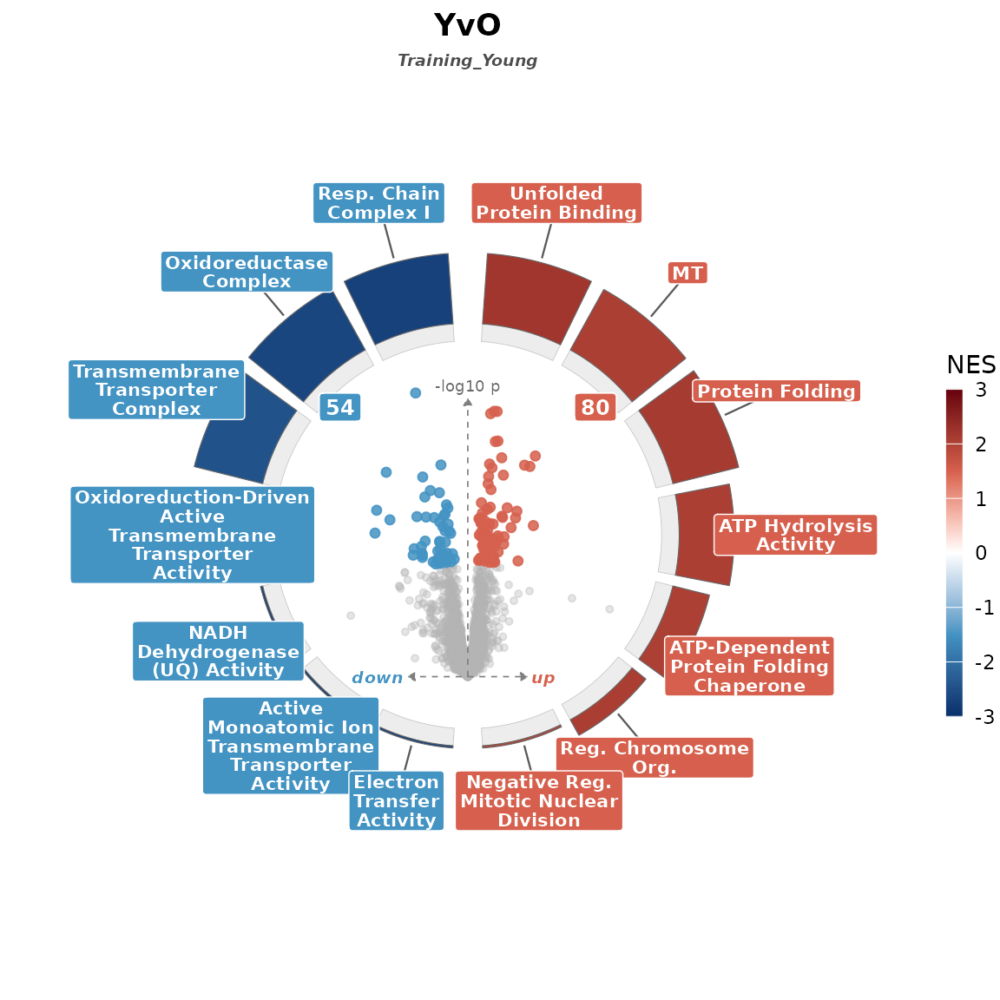
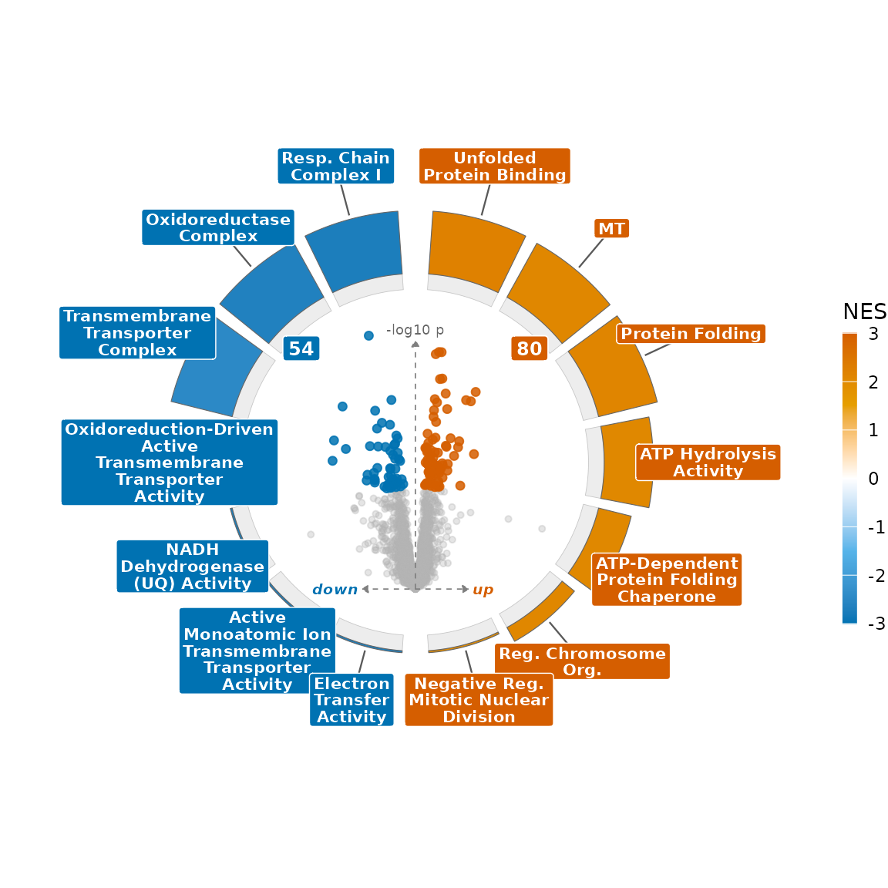

# Customizing the composite

Every composite comes from one call to
[`volcano_ring()`](https://Dustyn-T-Lewis.github.io/enrichVolcano/reference/volcano_ring.md).
The defaults are chosen to read well, and you reach everything else
through two places:

- **[`volcano_ring_theme()`](https://Dustyn-T-Lewis.github.io/enrichVolcano/reference/volcano_ring_theme.md)**
  controls the *looks*: point colours and the NES ramp.
- **[`volcano_ring()`](https://Dustyn-T-Lewis.github.io/enrichVolcano/reference/volcano_ring.md)
  arguments** control the *data mapping and layout*: what counts as
  significant, how arcs are ordered and sized, what gets labelled.

This vignette walks the knobs section by section on the bundled YvO
example.

``` r

library(enrichVolcano)

da <- read.csv(system.file("extdata", "examples", "yvo_da.csv",
  package = "enrichVolcano"
))
en <- read.csv(system.file("extdata", "examples", "yvo_enrichment.csv",
  package = "enrichVolcano"
))
ctr <- "Training_Young"
da1 <- da[da$contrast == ctr, , drop = FALSE]
names(da1)[names(da1) == "adj.P.Val"] <- "padj"

# The bundled table spans many databases, far more terms than read cleanly
# as a ring. Keep the significant ones and take the top 7 per direction;
# which pathways appear is always your choice.
curate <- function(contrast, n = 7) {
  s <- en[en$contrast == contrast & en$padj < 0.05 & is.finite(en$NES), ]
  s <- s[order(s$padj), ]
  rbind(head(s[s$NES > 0, ], n), head(s[s$NES < 0, ], n))
}
en1 <- curate(ctr)
```

The starting point, all defaults:

``` r

volcano_ring(da1, en1, title = "YvO", subtitle = ctr)
```



## Colours

Three presets ship: `"default"` (red/blue diverging), `"viridis"`, and
`"okabe"` (colour-blind-safe). Swap one in through `theme`:

``` r

volcano_ring(da1, en1, theme = volcano_ring_theme(palette = "okabe"))
```



To set your own colours, pass them straight to
[`volcano_ring_theme()`](https://Dustyn-T-Lewis.github.io/enrichVolcano/reference/volcano_ring_theme.md):
`up`, `down`, `ns` for the points, and `nes_colors` (with optional
`nes_limits`) for the arc ramp.

``` r

my_theme <- volcano_ring_theme(
  up = "#B2182B", down = "#2166AC", ns = "grey80",
  nes_colors = c("#053061", "white", "#67001F"),
  nes_limits = c(-2.5, 2.5)
)
volcano_ring(da1, en1, theme = my_theme)
```


## The volcano

The centre is an ordinary volcano. `p_threshold` and `logfc_threshold`
define the up/down call; `point_size` and `point_alpha` size the cloud;
`label_mode` decides which proteins get text.

``` r

volcano_ring(da1, en1,
  p_threshold = 0.01, logfc_threshold = log2(1.5),
  point_size = 2.2, point_alpha = 0.6,
  label_mode = "top_per_direction", label_n = 4
)
```


## The ring

Arc **fill** is NES; arc **thickness** is a magnitude you choose with
`magnitude`, either `"neg_log_padj"` (default) or `"size"` (the gene-set
size). `arc_height_range` sets how short the smallest arc and how tall
the largest arc get, so you can flatten or exaggerate that encoding.

``` r

volcano_ring(da1, en1,
  magnitude = "size",
  arc_height_range = c(0.1, 2.2)
)
```


`arc_order` sets where each arc sits within its half. The up/down split
is always by NES sign; within each half you order by FDR (`"padj"`, the
default) or by enrichment strength (`"nes"`):

``` r

volcano_ring(da1, en1, arc_order = "nes")
```


## Layout

The up/down badges count significant points; turn them off with
`show_counts = FALSE`, or nudge them with `count_x_mult` /
`count_y_mult`. `title`, `subtitle`, and `tag` set the text.

``` r

volcano_ring(da1, en1,
  show_counts = FALSE,
  title = "Young vs Old", subtitle = "trained", tag = "A"
)
```


## Putting it together in a grid

[`volcano_ring_grid()`](https://Dustyn-T-Lewis.github.io/enrichVolcano/reference/volcano_ring_grid.md)
forwards every one of these arguments to each panel, so a styled grid is
the same knobs passed once:

``` r

da_old <- da[da$contrast == "Training_Old", ]
names(da_old)[names(da_old) == "adj.P.Val"] <- "padj"

g <- volcano_ring_grid(
  list(Young = da1, Old = da_old),
  list(Young = en1, Old = curate("Training_Old")),
  ncol = 2,
  theme = my_theme, arc_order = "nes", show_counts = FALSE
)
g$plot
```


For the column conventions and a limma / DESeq2 / edgeR / fgsea /
clusterProfiler / enrichR cross-walk, see
[`vignette("input-contract")`](https://Dustyn-T-Lewis.github.io/enrichVolcano/articles/input-contract.md).
