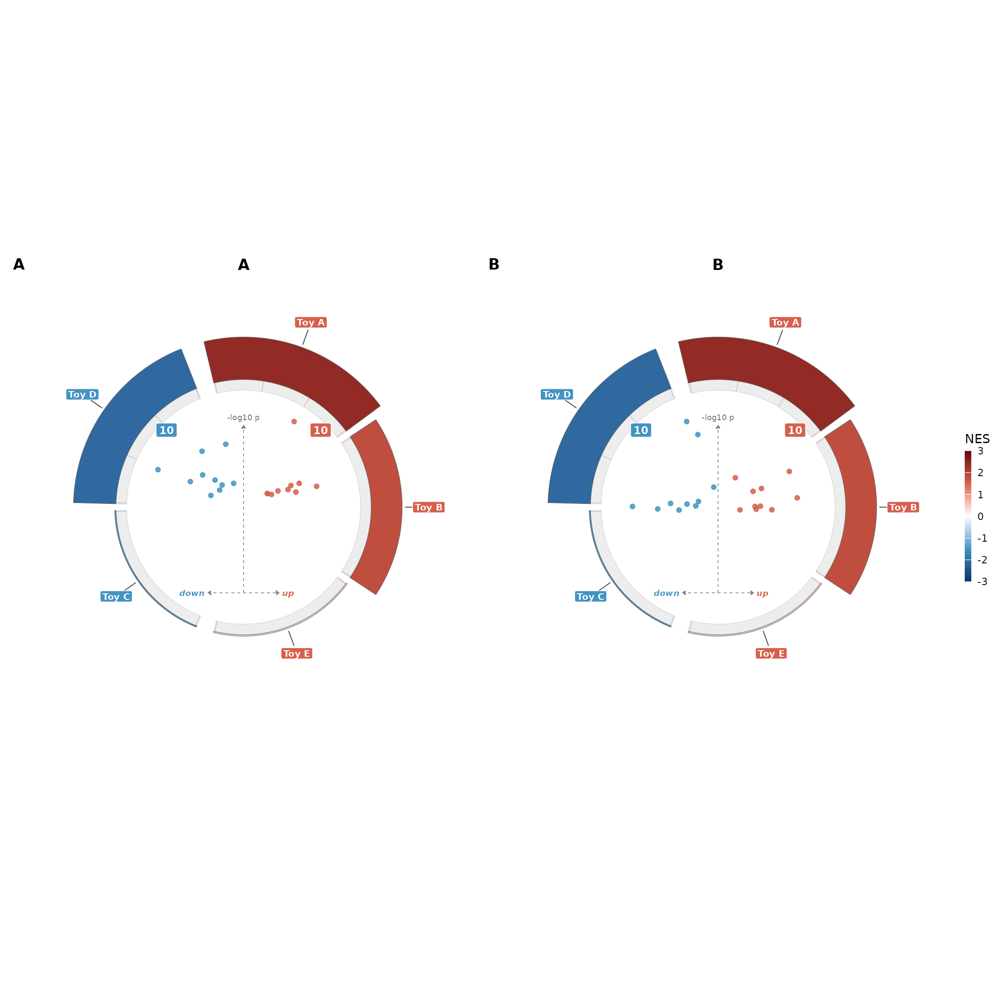

# Getting started

`enrichVolcano` draws one composite figure from two tidy tables that you
have already computed: a differential-abundance (DA) table and an
enrichment table. Computing the enrichment is delegated to whichever
upstream tool fits your study — `fgsea`, `clusterProfiler`, `enrichR`,
or your own.

This vignette walks the end-to-end path on the bundled YvO proteomics
example (Young vs Old human plasma; one contrast, `Training_Young`).

## Install

If you do not have remotes installed:

``` r

install.packages("remotes")
```

Then:

``` r

remotes::install_github("Dustyn-T-Lewis/enrichVolcano")
```

## Read the two tables

The package ships small slices of four datasets under
`inst/extdata/examples/`.
[`system.file()`](https://rdrr.io/r/base/system.file.html) resolves to
the install path.

``` r

library(enrichVolcano)

da_path <- system.file("extdata", "examples", "yvo_da.csv",
  package = "enrichVolcano"
)
en_path <- system.file("extdata", "examples", "yvo_enrichment.csv",
  package = "enrichVolcano"
)

da <- read.csv(da_path)
en <- read.csv(en_path)

str(da, max.level = 1, give.attr = FALSE)
#> 'data.frame':    8452 obs. of  6 variables:
#>  $ gene     : chr  "MMP24OS" "ESYT2" "ILVBL" "FSD2" ...
#>  $ contrast : chr  "Training_Young" "Training_Young" "Training_Young" "Training_Young" ...
#>  $ logFC    : num  -0.27417 0.13438 0.09914 0.02035 -0.00493 ...
#>  $ P.Value  : num  0.472 0.359 0.535 0.877 0.981 ...
#>  $ adj.P.Val: num  0.726 0.658 0.772 0.95 0.995 ...
#>  $ pi_eq2   : num  0.814 0.871 0.94 0.997 1 ...
str(en, max.level = 1, give.attr = FALSE)
#> 'data.frame':    5383 obs. of  6 variables:
#>  $ contrast: chr  "Training_Young" "Training_Young" "Training_Young" "Training_Young" ...
#>  $ database: chr  "GO_BP" "GO_BP" "GO_BP" "GO_BP" ...
#>  $ pathway : chr  "mitochondrial electron transport, NADH to ubiquinone" "proton motive force-driven mitochondrial ATP synthesis" "proton transmembrane transport" "ribose phosphate biosynthetic process" ...
#>  $ NES     : num  -2.73 -2.61 -2.51 -2.18 2.13 ...
#>  $ padj    : num  2.58e-08 2.58e-08 2.58e-08 1.56e-06 1.51e-05 ...
#>  $ size    : int  39 60 85 93 90 39 28 28 117 38 ...
```

The YvO DA table is a limma moderated-t output: `gene`, `contrast`,
`logFC`, `P.Value`, `adj.P.Val`, `pi_eq2`. The enrichment table is in
the fgsea schema with a per-row contrast column: `contrast`, `database`,
`pathway`, `NES`, `padj`, `size`. There is one contrast here
(`Training_Young`).

## Slice to a single contrast

[`volcano_ring()`](https://Dustyn-T-Lewis.github.io/enrichVolcano/reference/volcano_ring.md)
draws one composite per call. Multi-contrast composing is what
[`volcano_ring_grid()`](https://Dustyn-T-Lewis.github.io/enrichVolcano/reference/volcano_ring_grid.md)
is for.

``` r

ctr <- "Training_Young"
da1 <- da[da$contrast == ctr, , drop = FALSE]
en1 <- en[en$contrast == ctr, , drop = FALSE]
nrow(da1)
#> [1] 2113
nrow(en1)
#> [1] 1382
```

## Map column names

The YvO DA carries `adj.P.Val`, not `padj`. The shared `padj_col`
argument names *both* the adjusted-p column on the DA side and the
adjusted-p column on the enrichment side, so they need to agree. Two
options: pass `padj_col = "adj.P.Val"` (but then the enrichment side
needs that column too), or rename the DA column to `padj` once at the
boundary. The second is simpler.

``` r

names(da1)[names(da1) == "adj.P.Val"] <- "padj"
```

## Draw the composite

``` r

suppressMessages(
  volcano_ring(da1, en1, title = "YvO", subtitle = ctr)
)
#> Warning: Duplicate values in "pathway"; keeping the row with the lowest padj per term.
#> ℹ 494 duplicate rows dropped.
```


The figure puts the volcano in the centre. NES-coloured arcs around it
encode each enriched pathway: arc fill is NES (red up, blue down by
default), arc thickness is `-log10(padj)`, and the up/down split lives
on the right vs left semicircle. The pre-filtering of which pathways
appear is up to you — every row of `enrich_df` becomes one arc.

## A multi-contrast grid

When you have several contrasts to show side by side, pass two named
lists to
[`volcano_ring_grid()`](https://Dustyn-T-Lewis.github.io/enrichVolcano/reference/volcano_ring_grid.md).
The function calls
[`volcano_ring()`](https://Dustyn-T-Lewis.github.io/enrichVolcano/reference/volcano_ring.md)
once per panel and composes them with
[`patchwork::wrap_plots()`](https://patchwork.data-imaginist.com/reference/wrap_plots.html).

``` r

set.seed(1)
toy_volc <- function(seed) {
  set.seed(seed)
  data.frame(
    gene = paste0("G", 1:20),
    contrast = "toy",
    logFC = c(rnorm(10, 2), rnorm(10, -2)),
    P.Value = c(runif(10, 0, 0.01), runif(10, 0, 0.01)),
    padj = c(runif(10, 0, 0.04), runif(10, 0, 0.04))
  )
}
toy_enrich <- function(seed) {
  set.seed(seed)
  data.frame(
    pathway = paste0("HALLMARK_TOY_", LETTERS[1:5]),
    NES = c(2.4, 1.8, -1.5, -2.1, 0.4),
    padj = c(0.001, 0.02, 0.01, 0.005, 0.5),
    size = c(40, 30, 25, 35, 18),
    leading_edge = c(
      "G1;G2;G3;G4", "G5;G6", "G11;G12",
      "G13;G14;G15;G16", "G7;G17"
    )
  )
}
g <- suppressMessages(volcano_ring_grid(
  list(A = toy_volc(1), B = toy_volc(2)),
  list(A = toy_enrich(1), B = toy_enrich(2)),
  ncol = 2
))
g$plot
```



## Common knobs

The full argument list is in
[`?volcano_ring`](https://Dustyn-T-Lewis.github.io/enrichVolcano/reference/volcano_ring.md),
but four come up constantly:

- `magnitude = "neg_log_padj"` (default) or `"size"` — what controls arc
  thickness.
- `genes_col` and `genes_sep` — override the tick-line auto-detect.
  Auto-detect walks `leading_edge`, `leadingEdge`, `core_enrichment`,
  `Genes` in that order.
- `label_mode` — `"none"`, `"top_per_direction"`, `"by_significance"`,
  `"by_genes"` — controls which volcano points are labelled.
- `theme = volcano_ring_theme(palette = "viridis")` — swap the palette
  without re-passing every aesthetic.

## What this package does not do

`enrichVolcano` does not run the enrichment for you. If you need to
compute it, here are the canonical paths:

``` r

# fgsea (Korotkevich 2021, DOI 10.1101/060012):
ranks <- df$t; names(ranks) <- df$gene
res <- fgsea::fgseaMultilevel(pathways, stats = ranks)

# clusterProfiler::gseGO (Yu 2012; Wu 2021):
res <- clusterProfiler::gseGO(
  geneList = sort(setNames(df$logFC, df$gene), decreasing = TRUE),
  ont = "BP", OrgDb = org.Hs.eg.db::org.Hs.eg.db
)

# enrichR (Chen 2013; Kuleshov 2016):
res <- enrichR::enrichr(genes, "GO_Biological_Process_2023")[[1]]
```

The result of any of these is a tidy frame you can pass straight to
[`volcano_ring()`](https://Dustyn-T-Lewis.github.io/enrichVolcano/reference/volcano_ring.md).
See
[`vignette("input-contract")`](https://Dustyn-T-Lewis.github.io/enrichVolcano/articles/input-contract.md)
for column names that work out of the box.
